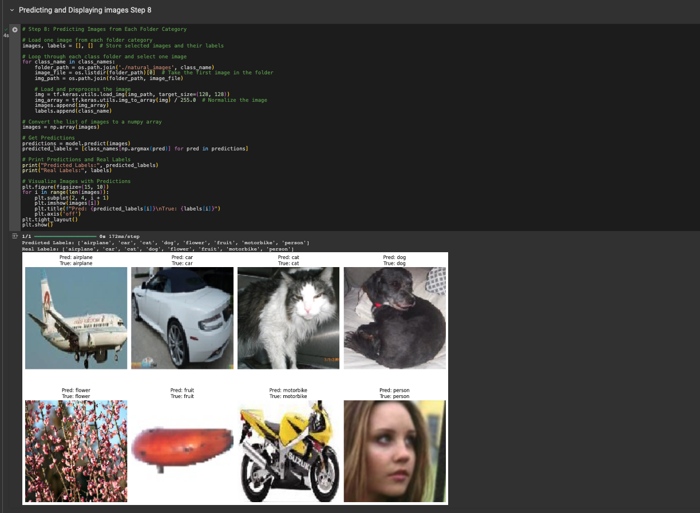

# Machine-Learning-Image-Recognition-Model

## Project Overview
This project involves building a **Convolutional Neural Network (CNN)** to classify images into 8 categories using the **Natural Images Dataset** from Kaggle. The model is implemented in TensorFlow/Keras and trained to recognize images belonging to the following classes:
- **Airplane**
- **Car**
- **Cat**
- **Dog**
- **Flower**
- **Fruit**
- **Motorbike**
- **Person**

The dataset includes over 6,000 images and is resized for consistency during training and validation. This repository includes the notebook, steps to reproduce the results, and instructions to run the model successfully.

---

## Table of Contents
1. [Dataset Information](#dataset-information)
2. [Prerequisites](#prerequisites)
3. [How to Run](#how-to-run)
4. [Model Architecture](#model-architecture)
5. [Results](#results)
6. [Project Files](#project-files)

---

## Dataset Information
The **Natural Images Dataset** contains 8 labeled image classes and can be downloaded from the following source:

[**Kaggle Natural Images Dataset**](https://www.kaggle.com/datasets/prasunroy/natural-images)

- Total images: 6,899
- Image size: Resized to **128x128**
- Classes: `airplane`, `car`, `cat`, `dog`, `flower`, `fruit`, `motorbike`, and `person`

---

## Prerequisites

Ensure the following tools and libraries are installed before running the project:
1. **Python 3.x**
2. **TensorFlow 2.x**
3. **Keras**
4. **Google Colab** (Recommended for smooth execution)
5. Other libraries: 
   - `NumPy`
   - `Matplotlib`
   - `Zipfile`
   - `Google Colab Drive` (optional for mounting data)

---

## How to Run

### Option 1: Direct Upload of `archive.zip` (Preferred)
1. Download the dataset from [Kaggle](https://www.kaggle.com/datasets/prasunroy/natural-images) and save it as **`archive.zip`**.
2. Clone this repository using the following command:
   ```bash
   git clone https://github.com/your-username/Machine-Learning-Image-Recognition-Model.git
   cd Machine-Learning-Image-Recognition-Model
   ```
3. Open the `Final_Project.ipynb` notebook using **Google Colab**.
4. Upload the **`archive.zip`** file in Colab and follow these steps:
   - Run the "Importing the Dataset" step to extract the data.
5. Execute all cells sequentially in the notebook:
   - **Step 1**: Import Libraries
   - **Step 2**: Load and Extract Dataset
   - **Step 3**: Preprocess Data (Resize, Normalize)
   - **Step 4**: Define the CNN Model
   - **Step 5**: Train the Model
   - **Step 6**: Evaluate Accuracy and Loss
   - **Step 7**: Visualize Training Performance
   - **Step 8**: Predict and Display Test Results

---

### Option 2: Mounting Google Drive
If the dataset is stored in **Google Drive**, follow these steps:
1. Save the **`archive.zip`** file under `My Drive/Colab Notebooks/`.
2. In the notebook, replace the file path with:
   ```python
   zip_path = '/content/drive/My Drive/Colab Notebooks/archive.zip'
   ```
3. Mount Google Drive in Colab:
   ```python
   from google.colab import drive
   drive.mount('/content/drive')
   ```
4. Proceed to extract the file and run the notebook.

---

## Model Architecture

The model is a **Convolutional Neural Network (CNN)** with the following layers:
1. **Input**: 128x128 RGB Images
2. **Conv2D + MaxPooling**: 
   - Layer 1: 32 filters, 3x3 kernel, ReLU activation
   - Layer 2: 64 filters, 3x3 kernel, ReLU activation
3. **Flatten**
4. **Dense Layers**:
   - Layer 1: 300 neurons, ReLU activation
   - Layer 2: 100 neurons, ReLU activation
   - Output Layer: 8 neurons (Softmax activation for multi-class classification)

---

## Results

The trained CNN achieved the following performance on the **Validation Set**:
- **Validation Accuracy**: ~90.05%
- **Validation Loss**: ~0.48

### Training and Validation Performance


---

## Project Files

- **`Final_Project.ipynb`**: Main notebook with all steps to run the model.
- **`README.md`**: Instructions to download, run, and reproduce the results.
- **`Image depicting the model accuracy.png`**: Visualizes the model's accuracy and loss.
- **Dataset**: Downloaded separately from Kaggle.

---

## How to Use the Results
1. The model can classify images into one of 8 predefined categories.
2. Use this project as a foundation to:
   - Experiment with different architectures.
   - Fine-tune hyperparameters (epochs, batch size, learning rate).
   - Apply transfer learning for better results.
3. Run predictions on custom images by modifying the test section of the notebook.

---

## Contributors
- Sezer Cherosky Saralar

---

## Acknowledgments
- Dataset: [Prasun Roy's Natural Images on Kaggle](https://www.kaggle.com/datasets/prasunroy/natural-images)
- Framework: TensorFlow/Keras
- Tools: Google Colab, GitHub